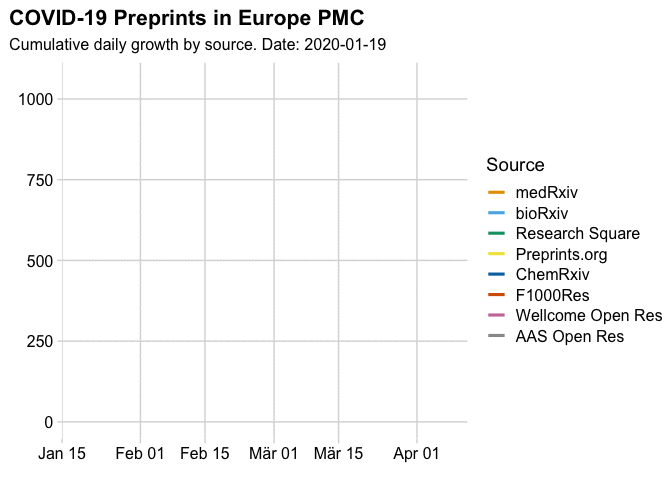

[](https://mybinder.org/v2/gh/njahn82/epmc_covid/master?urlpath=rstudio)


```{r setup, include=FALSE}
knitr::opts_chunk$set(
  comment = "#>",
  warning = FALSE,
  message = FALSE,
  echo = TRUE
)
```

### Prerequisites

Required libraries, all available from CRAN

```{r}
library(europepmc) # Europe PMC data
library(tidyverse) # transform and visualise
library(cowplot) # nice ggplot themes
library(colorblindr) # accessible colour palettes
library(gganimate) # animate ggplot graphics
library(transformr) # helper library for gganimate
```

### Get Preprint metadata from Europe PMC

Europe PubMed Central recommends the following [query to retrieve literature about the Coronavirus](https://europepmc.org/search?query=%28%222019-nCoV%22%20OR%20%222019nCoV%22%20OR%20%22COVID-19%22%20OR%20%22SARS-CoV-2%22%20OR%20%28%22wuhan%22%20AND%20%22coronavirus%22%29%20OR%20%22Coronavirus%22%20OR%20%22Corona%20virus%22%20OR%20%22corona-virus%22%20OR%20%22corona%20viruses%22%20OR%20%22coronaviruses%22%20OR%20%22SARS-CoV%22%20OR%20%22Orthocoronavirinae%22%20OR%20%22MERS-CoV%22%20OR%20%22Severe%20Acute%20Respiratory%20Syndrome%22%20OR%20%22Middle%20East%20Respiratory%20Syndrome%22%20OR%20%28%22SARS%22%20AND%20%22virus%22%29%20OR%20%22soluble%20ACE2%22%20OR%20%28%22ACE2%22%20AND%20%22virus%22%29%20OR%20%28%22ARDS%22%20AND%20%22virus%22%29%20or%20%28%22angiotensin-converting%20enzyme%202%22%20AND%20%22virus%22%29%29%20AND%20%28SRC%3APPR%29%20AND%20%28FIRST_PDATE%3A2020%29&page=1). We will restrict this query to Preprints published in 2020.


```{r}
corona_query <- c('("2019-nCoV" OR "2019nCoV" OR "COVID-19" OR "SARS-CoV-2" OR ("wuhan" AND "coronavirus") OR "Coronavirus" OR "Corona virus" OR "corona-virus" OR "corona viruses" OR "coronaviruses" OR "SARS-CoV" OR "Orthocoronavirinae" OR "MERS-CoV" OR "Severe Acute Respiratory Syndrome" OR "Middle East Respiratory Syndrome" OR ("SARS" AND "virus") OR "soluble ACE2" OR ("ACE2" AND "virus") OR ("ARDS" AND "virus") or ("angiotensin-converting enzyme 2" AND "virus")) AND (SRC:PPR) AND (FIRST_PDATE:2020)')
```


```{r}
epmc_data <-
  europepmc::epmc_search(corona_query, 
                         limit = 10000, "raw")
```

### Some data transformation

```{r}
preprint_df <- epmc_data %>%
  tibble::tibble(
    preprint_source = purrr::map(., "bookOrReportDetails") %>%
      purrr::map_chr("publisher"),
    online_date = purrr::map_chr(., "firstPublicationDate"),
    doi = purrr::map_chr(., "doi")
  ) %>%
  mutate(online_date = lubridate::ymd(online_date)) %>%
  mutate(preprint_source = fct_infreq(preprint_source)) %>%
  group_by(online_date, preprint_source) %>%
  summarise(n = n()) %>%
  ungroup() %>%
  group_by(preprint_source) %>%
  mutate(cumsum_n = cumsum(n))
#' Resulting summary data
preprint_df
```


### Visualisations 

```{r}
preprint_plot <- ggplot(
  preprint_df,
  aes(online_date, cumsum_n, colour = preprint_source)
) +
  geom_line(stat = "identity", size = 1.1) +
  scale_color_manual("Source", values = c(colorblindr::palette_OkabeIto)) +
  theme_minimal_grid()  +
  theme(plot.title.position = "plot")
```

Static Version

```{r, fig.width = 6, fig.asp = 0.618, out.width = "70%", fig.align = "center", dpi = 300}
preprint_plot +
  labs(
    y = NULL,
    x = NULL,
    title = "COVID-19 Preprints in Europe PMC",
    subtitle = "Cumulative daily growth by source"
  )
```

Animated line chart

```{r, results = FALSE}
animated_plot <- preprint_plot +
  transition_reveal(online_date) +
  labs(
    y = NULL,
    x = NULL,
    title = "COVID-19 Preprints in Europe PMC",
    subtitle = "Cumulative daily growth by source. Date: {frame_along}"
  )
anim_save("figure/epmc_growth.gif", animated_plot)
```



### You want more?

Check out Nicholas Fraser's great COVID-19 Preprints project, which keep tracks of relevant Preprints using Crossref and inspired this little project.

https://github.com/nicholasmfraser/covid19_preprints

### Meta

License: MIT

